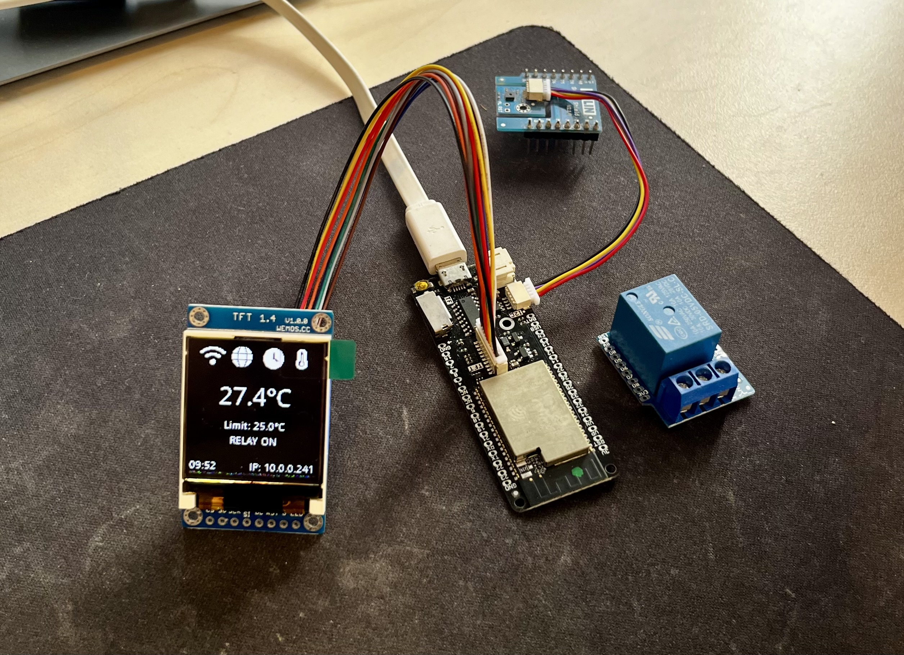

# Deye Inverter Fan Controller

An ESPHome-based temperature-controlled fan system for Deye hybrid inverters. This project monitors temperature and automatically controls cooling fans to keep your inverter running efficiently.



> [!WARNING]
> **Work in Progress**: This project is very much a work in progress and not ready for prime time without some effort to fix remaining issues. See the [TODO](#todo) section for known items that need attention before production use.

## About

This was a late-night mini project inspired by:
- [Keeping a Deye inverter cool – A 3D-printed dual-fan solution](https://extruder.co.nz/keeping-a-deye-inverter-cool-a-3d-printed-dual-fan-solution/)
- [Reddit discussion on r/nzsolar](http://reddit.com/r/nzsolar/comments/1o6antx)

The goal was to create a smart, connected solution that integrates seamlessly with Home Assistant while providing real-time temperature monitoring and automated fan control.

## Features

- 🌡️ **Temperature & Humidity Monitoring** - Real-time sensor data via SHT30
- 🔌 **Automated Relay Control** - Temperature-based fan switching
- 📊 **1.44" TFT Display** - Shows temperature, limits, and relay status at a glance
- 🏠 **Home Assistant Integration** - Easily added to Home Assistant via ESPHome
- 📡 **WiFi Connectivity** - Remote monitoring and control
- ⏰ **NTP Time Sync** - Accurate timestamps and scheduling
- 🌐 **Web Interface** - Built-in web server for configuration

## Hardware Bill of Materials

All components are from [WEMOS](https://www.wemos.cc/en/):

| Component | Description | Link |
|-----------|-------------|------|
| **D32 Pro** | ESP32-WROVER development board<br>• 16MB Flash, 8MB PSRAM<br>• WiFi & Bluetooth<br>• 3.3V operation | [Wemos D32 Pro](https://www.wemos.cc/en/latest/d32/d32_pro.html) |
| **SHT30 Shield** | I2C Temperature & Humidity Sensor<br>• ±3% RH accuracy<br>• ±0.3°C temperature accuracy<br>• I2C interface (SDA: GPIO21, SCL: GPIO22) | [Wemos SHT30 Shield](https://www.wemos.cc/en/latest/d1_mini_shield/sht30.html) |
| **Relay Shield** | Solid State Relay Module<br>• 5A @ 250VAC / 30VDC (NO)<br>• Control pin: Configurable (default GPIO5) | [Wemos Relay Shield](https://www.wemos.cc/en/latest/d1_mini_shield/relay.html) |
| **TFT 1.4 Shield** | 1.44" Color Display<br>• 128x128 resolution<br>• ST7735S driver<br>• SPI interface | [Wemos TFT 1.4" Shield](https://www.wemos.cc/en/latest/d1_mini_shield/tft_1_4.html) |

### Additional Components (not included)
- 120mm PC cooling fan(s) (12V recommended)
- 12V power supply
- Wiring and connectors
- Mounting hardware

## Pin Configuration

The project uses the following GPIO pins on the ESP32:

| GPIO | Function | Component |
|------|----------|-----------|
| 21 | I2C SDA | SHT30 Sensor |
| 22 | I2C SCL | SHT30 Sensor |
| 18 | SPI CLK | TFT Display |
| 23 | SPI MOSI | TFT Display |
| 14 | TFT CS | TFT Display |
| 27 | TFT DC | TFT Display |
| 33 | TFT RST | TFT Display |
| TBD | Relay Control | Relay Module |

## Hardware Pinout Diagrams

### WEMOS D32 Pro

*Source: [WEMOS D32 Pro Documentation](https://www.wemos.cc/en/latest/d32/d32_pro.html)*

### SHT30 Shield


**Pin Connections:**
- D1 (GPIO 5) → SCL
- D2 (GPIO 4) → SDA

*Note: For ESP32, we use GPIO 22 (SCL) and GPIO 21 (SDA) instead.*

*Source: [WEMOS SHT30 Shield Documentation](https://www.wemos.cc/en/latest/d1_mini_shield/sht30.html)*

### Relay Shield


**Specifications:**
- Load: 5A @ 250VAC / 30VDC (NO)
- Control Pin: D1 (GPIO 5) on D1 Mini / Configurable on ESP32

*Source: [WEMOS Relay Shield Documentation](https://www.wemos.cc/en/latest/d1_mini_shield/relay.html)*

### TFT 1.4" Display Shield


**Pin Connections (SPI):**
- D5 (GPIO 14) → CS
- D6 (GPIO 12) → D/C  
- D7 (GPIO 13) → RST
- D8 (GPIO 15) → LED (Backlight)
- SCK → CLK
- MOSI → DIN

*Note: Pin mappings adjusted for ESP32 - see Pin Configuration table above.*

*Source: [WEMOS TFT 1.4" Shield Documentation](https://www.wemos.cc/en/latest/d1_mini_shield/tft_1_4.html)*

## Setup Instructions

### Prerequisites
- [ESPHome](https://esphome.io/) installed
- Home Assistant (optional, but recommended)
- WiFi network credentials

### Installation

1. **Clone or download this repository**
   ```bash
   git clone <your-repo-url>
   cd deyefan
   ```

2. **Configure your secrets**
   ```bash
   cp secrets.yaml.sample secrets.yaml
   ```
   Edit `secrets.yaml` with your WiFi credentials and passwords.

3. **Install required fonts**
   
   Download the following fonts and place them in the project directory:
   - **OpenSans-Regular.ttf** - For text display
     - Download from: https://fonts.google.com/specimen/Open+Sans (click "Download family", extract the TTF)
   - **fa-solid-900.ttf** - For Font Awesome icons
     - Download: https://github.com/FortAwesome/Font-Awesome/raw/6.x/webfonts/fa-solid-900.ttf

4. **Compile and upload**
   ```bash
   esphome compile deye_fan_esp32.yaml
   esphome upload deye_fan_esp32.yaml
   ```

5. **Add to Home Assistant**
   - Go to Settings → Devices & Services
   - ESPHome should auto-discover your device
   - Click "Configure" and enter your API password

## Configuration

### Temperature Threshold

The default temperature limit is **25°C**. You can adjust this:
- Via the Home Assistant interface (recommended)
- Through the web interface at `http://deye-fan-esp32.local`
- By modifying the `initial_value` in the YAML configuration

### Display Information

The TFT display shows:
- **Top bar**: Status icons (WiFi, Internet, NTP, Sensor)
- **Center**: Current temperature (large, prominent)
- **Middle**: Temperature limit setting
- **Below**: Relay state (ON/OFF)
- **Bottom left**: Current time
- **Bottom right**: IP address

## How It Works

1. The SHT30 sensor monitors temperature every 10 seconds
2. Every 5 seconds, the system checks if temperature exceeds the set limit
3. When temperature is above the limit, the relay activates (turns on fans)
4. When temperature drops below the limit, the relay deactivates
5. Display updates every 3 seconds with current status
6. All data is available in Home Assistant for monitoring and automation

## Performance

Based on the inspiration project, active cooling can reduce inverter surface temperature by **10-20°C** during peak operation, improving:
- Component longevity
- Inverter efficiency
- Overall reliability

## Customization

### Adjust Update Intervals

In `deye_fan_esp32.yaml`, modify:
- Sensor update: `update_interval: 10s` (line 107)
- Display update: `update_interval: 3s` (line 200)
- Temperature check: `interval: 5s` (line 162)

### Change Temperature Logic

Modify the `interval` section (lines 156-186) to implement:
- Hysteresis (temperature differential)
- Time-based overrides
- Multiple temperature zones

## Troubleshooting

### Device won't connect to WiFi
- Check `secrets.yaml` credentials
- Ensure 2.4GHz WiFi (ESP32 doesn't support 5GHz)
- Try the fallback hotspot: SSID from `secrets.yaml`

### Sensor not reading
- Verify I2C connections (SDA: 21, SCL: 22)
- Check sensor address (default: 0x45)
- View logs: `esphome logs deye_fan_esp32.yaml`

### Display not working
- Verify SPI connections
- Check display model matches (ST7735, INITR_GREENTAB)
- Ensure fonts are in the project directory

## TODO

- [ ] **Wire up the relay module** - This is straightforward, just haven't bothered getting out the soldering iron yet. Once connected, configure the relay control GPIO pin in the YAML file.
- [ ] **Debug and fix networking issues** - Web interface times out, etc. Need to investigate and resolve connectivity problems.

## Contributing

Feel free to open issues or submit pull requests with improvements!

## License

This project is open source. Feel free to modify and adapt for your needs.

## Acknowledgments

- [extruder.co.nz](https://extruder.co.nz/) - For the original 3D-printed cooling solution concept
- [r/nzsolar community](http://reddit.com/r/nzsolar/) - For inspiration and discussion
- [WEMOS](https://www.wemos.cc/) - For excellent, affordable ESP32 hardware
- [ESPHome](https://esphome.io/) - For making ESP32 programming accessible

---

**Note**: This project is not affiliated with or endorsed by Deye. Use at your own risk. Ensure proper electrical safety when working with inverters and mains power.

